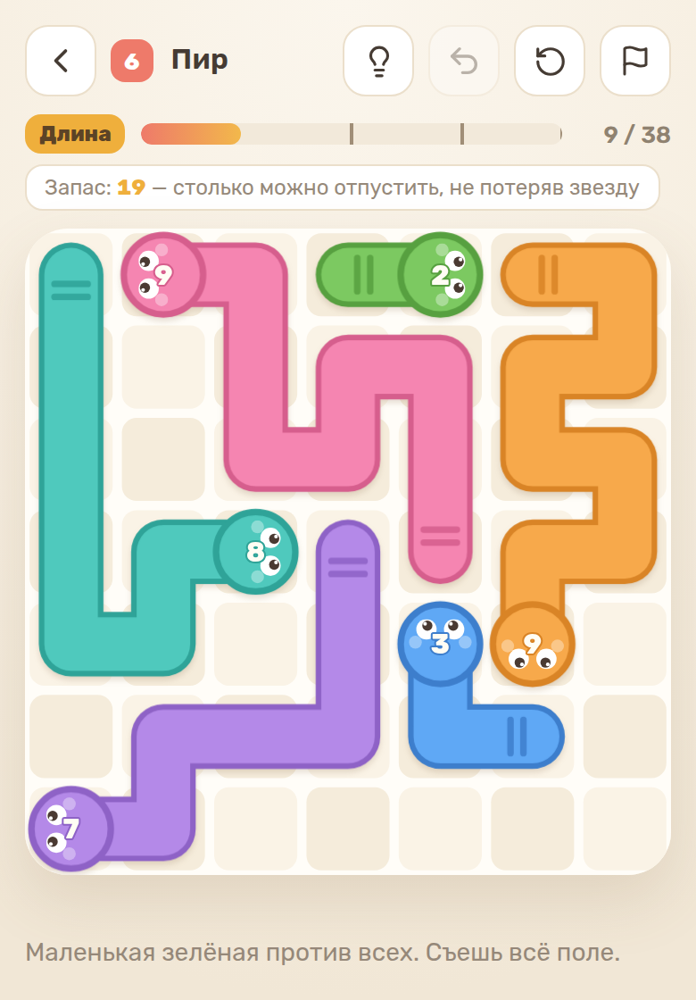

# Хвостоед

Головоломка про змей, которые едят друг друга за хвост. Тапаешь змею — она стреляет
взглядом вперёд: увидела чужой хвост, проглотила целиком и **переняла направление
съеденной**. Увидела тело или голову — авария (бесплатная: доска не меняется).
Увидела край — улетела с поля, и её длина пропала навсегда. Поле постепенно
сворачивается в одну гигантскую змею — это и есть главный кайф.

**Играть: https://artmartiros.github.io/hvostoed/**



## Что внутри

| Пак | Что это |
|---|---|
| **Азбука** | 30 обучающих уровней с нуля: без механик и без ловушек-обманок |
| **Пустота** | 19 уровней, только змеи: зазоры, переезды, бюджет длины |
| **Кампания** | 25 уровней с валунами и колючими змеями |
| **Комнаты** | 35 уровней, доска открывается по комнатам |
| **Мастерская** | генератор: крутишь ручки — он собирает уровень и проверяет его кодом игры |

Звёзды — это три отметки ДЛИНЫ: докуда доросла твоя змея к концу партии. Верхняя
отметка равна потолку поля — той длине, больше которой доска дорасти не даёт, — и
потому берётся всегда, а не «если повезло с раскладом».

Лампочка в шапке делает один ход настоящей лучшей линии — можно натыкать её подряд
и увидеть правильный порядок.

## Железное правило

Ни один уровень не едет без прогона солвера — и это не обещание, а ворота в CI
(`.github/workflows/pages.yml`): не прошли проверки — сайт не обновился.

```
node solver.js hvostoed.jsx    # геометрия, объявленный потолок и отметки звёзд
node hints.mjs hvostoed.jsx    # подсказка доводит до потолка за минимум ходов
node plancheck.mjs 4           # игра проходит задуманный план генератора, ход в ход
node ending.mjs hvostoed.jsx   # партия кончается ровно тогда, когда рост невозможен
node roomscheck.mjs            # «Комнаты»: игра проходит решение каждого уровня
```

Проверки берут данные из самого файла игры, а `hints.mjs`, `plancheck.mjs`,
`ending.mjs` и `roomscheck.mjs` вырезают и исполняют её собственный код —
тестируется то, что реально поедет, а не копия. Для проверок достаточно голого
Node 22, ставить зависимости не нужно.

## Как устроен репозиторий

Стек: React 18 + Vite 5, вся игра — один файл `hvostoed.jsx` (данные → логика →
подсказка → отрисовка → интерфейс → CSS). Рядом — генератор уровней
(`generator.mjs`, `presets.mjs`), метрики (`levelstats.mjs`, `audit.mjs`,
`analyze.mjs`) и проверки-ворота. Вторая страница сборки — `mvp.html`: поток из
14 уровней без меню для теста трафика, план и метрики — в
[mvp-plan.md](mvp-plan.md).

Карта проекта на одну страницу — [CLAUDE.md](CLAUDE.md) (для агентов есть симлинк
`AGENTS.md`): правила, файлы, проверки и договорённости. Как устроены уровни, чем
меряется сложность и какие ошибки уже совершены при генерации —
в [hvostoed-brief.md](hvostoed-brief.md). Как проект принимает решения об
итерациях — в [process.md](process.md).

## Разработка

```
npm install
npm run dev          # локальный запуск; npm run dev -- --host — для телефона
npm run build        # сборка в dist со service worker'ом (офлайн)
```
